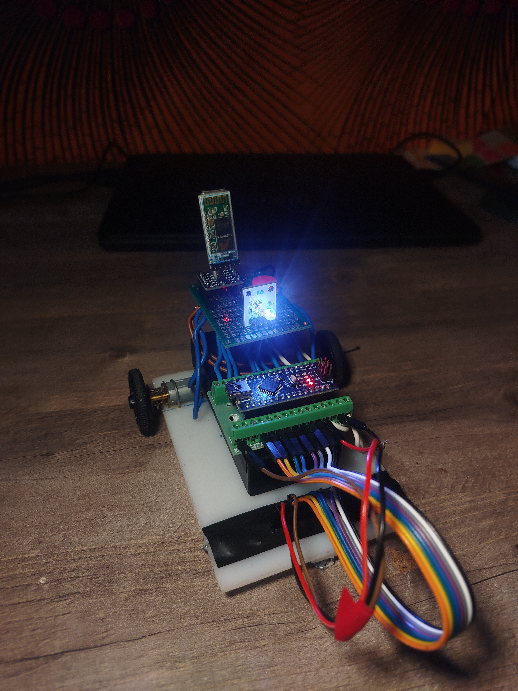

# LineFollower

lege repository die je als template kan gebruiken om een eigen repository te starten voor uw linefollower project

  
## specifications

microcontroller: Arduino Nano V3.0

motors: GA12-N20

h-bridge: DRV8833

sensors: QTR-8A

batteries: 18650 Li-ion

wireless communication: bluetooth, HC-05

distance sensor - motors: 8.5cm

weight: 222g

speed: ?

